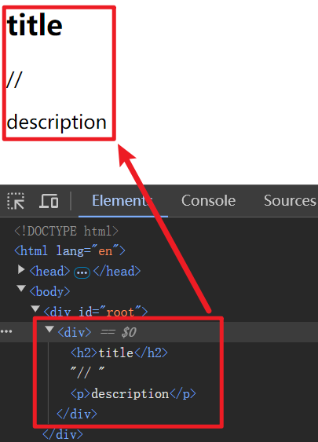

# [0015. 在 JSX 中使用注释](https://github.com/Tdahuyou/react/tree/main/0015.%20%E5%9C%A8%20JSX%20%E4%B8%AD%E4%BD%BF%E7%94%A8%E6%B3%A8%E9%87%8A)

<!-- region:toc -->
- [1. 🔗 jsx eslint 注释格式检测](#1--jsx-eslint-注释格式检测)
- [2. 📒 JSX 中注释的写法](#2--jsx-中注释的写法)
- [3. 💻 demos.1 - `//` - 错误的注释格式](#3--demos1------错误的注释格式)
- [4. 💻 demos.2 - 可以使用 jsx-eslint 检查错误的注释格式 `//`](#4--demos2---可以使用-jsx-eslint-检查错误的注释格式-)
<!-- endregion:toc -->
- 在 JSX 中，注释应该被包含在特殊的注释标签中，即 `{/* 这里边是注释内容 */}`。

## 1. 🔗 jsx eslint 注释格式检测

- https://github.com/jsx-eslint/eslint-plugin-react/blob/master/docs/rules/jsx-no-comment-textnodes.md
  - jsx-eslint - GitHub - Disallow comments from being inserted as text nodes (react/jsx-no-comment-textnodes)

## 2. 📒 JSX 中注释的写法

- 在 JSX 中使用注释的方式与在 JavaScript 中使用注释的方式有些不同。在 JSX 中，注释应该被包含在特殊的注释标签中，即 `{/* */}`。
- 注意：不要尝试以传统的 `//` 这种写法来注释 JSX 中的代码，这会被视作普通的字符串内容被渲染到页面上。

## 3. 💻 demos.1 - `//` - 错误的注释格式

```html
<!DOCTYPE html>
<html lang="en">
  <head>
    <meta charset="UTF-8" />
    <meta name="viewport" content="width=device-width, initial-scale=1.0" />
    <meta http-equiv="X-UA-Compatible" content="ie=edge" />
    <title>Document</title>
  </head>

  <body>
    <div id="root"></div>
    <!-- DOC https://legacy.reactjs.org/docs/cdn-links.html -->
    <script crossorigin src="https://unpkg.com/react@18/umd/react.development.js"></script>
    <script crossorigin src="https://unpkg.com/react-dom@18/umd/react-dom.development.js"></script>

    <!-- babel -->
    <script src="https://unpkg.com/babel-standalone@6/babel.min.js"></script>

    <script type="text/babel">
      const jsx = (
        // 下面是 JSX 语法
        <div>
          <h2>title</h2>
          // <p>description</p> // [!code highlight]
          {/* 这是 JSX 中的注释内容 */}
        </div>
      )

      const root = ReactDOM.createRoot(document.getElementById('root'))

      root.render(jsx)

      // 在这个 .html 文件的 script 脚本中的 JSX 部分，如果你使用快捷方式 ctrl + / 来注释代码，默认生成的是错误的注释格式。
    </script>
  </body>
</html>
```

- 最终的渲染结果：
  - 
- 上面这种写法是直接通过 cdn 的方式来引入相关资源写的一个 demo。也可以通过 pnpm create vite 来快速创建一个 react 工程来写 demo。

## 4. 💻 demos.2 - 可以使用 jsx-eslint 检查错误的注释格式 `//`

```jsx
import { StrictMode } from 'react'
import { createRoot } from 'react-dom/client'

function App() {
  return (
    // 下面是 JSX 语法
    <div>
      <h2>title</h2>
      // <p>description</p> // [!code error]
      {/* 这是 JSX 中的注释内容 */}
    </div>
  )
}

// 在这个 .jsx 文件中的 JSX 部分，你可以使用注释快捷方式 ctrl + / 来注释代码。生成的注释格式是满足 JSX 语法要求的。

createRoot(document.getElementById('root')).render(
  <StrictMode>
    <App />
  </StrictMode>,
)
```

- 在一些使用构建工具初始化的默认工程中，当你使用了错误的注释写法 `//` 时是会被检测出来的，这就是 eslint 在起作用。
- 你可以在 eslint.config.js 中配置忽略规则：

```js
"react/jsx-no-comment-textnodes": "off",
```

- 如果开启这个配置项的话，那么上述程序会报错。
  - 
- 可以这么理解，当你在 JSX 中出现 `// <p>description</p>` 这种写法时，并且开启了 `react/jsx-no-comment-textnodes` 检查，那么 eslint 会认为你希望注释掉这一行代码，但是你缺使用了错误的格式 `//`，JSX 中注释只能使用 `{/* */}` 这种写法，因此 eslint 会检查到错误，并爆红提醒你。


