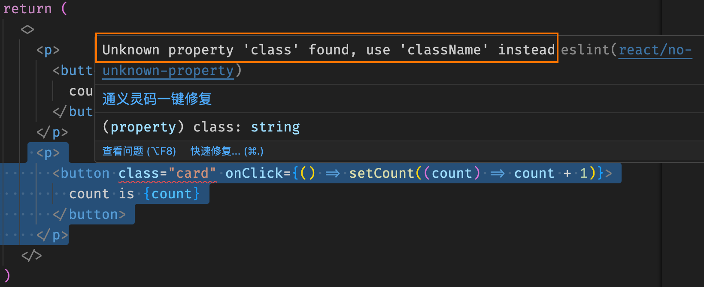

# [0004. 在 JSX 中需要使用 className 给元素添加 class](https://github.com/Tdahuyou/TNotes.react/tree/main/0004.%20%E5%9C%A8%20JSX%20%E4%B8%AD%E9%9C%80%E8%A6%81%E4%BD%BF%E7%94%A8%20className%20%E7%BB%99%E5%85%83%E7%B4%A0%E6%B7%BB%E5%8A%A0%20class)

<!-- region:toc -->
- [1. 🔍 查看 react 官方对“添加样式”的说明](#1--查看-react-官方对添加样式的说明)
- [2. 🤔 为什么不能直接使用 `class` 来添加样式，而是使用 `className` 呢？](#2--为什么不能直接使用-class-来添加样式而是使用-classname-呢)
- [3. **🤔 如果在添加样式的时候，不小心写成了 `class`，样式还能正常添加吗？**](#3--如果在添加样式的时候不小心写成了-class样式还能正常添加吗)
- [4. 💻 demos.1 - 添加样式](#4--demos1---添加样式)
- [5. 💻 demos.2 - 在 JSX 中也可以使用 class 添加样式](#5--demos2---在-jsx-中也可以使用-class-添加样式)
<!-- endregion:toc -->
- 在 React 中，我们通过使用 JSX 语法来定义组件模板，在组件模板中，我们可以使用 className 来指定一个 CSS 的 class。
  - ✅ ``
  - ❌ ``

## 1. 🔍 查看 react 官方对“添加样式”的说明

- 
- https://zh-hans.react.dev/learn#adding-styles

> 在 React 中，你可以使用 className 来指定一个 CSS 的 class。它与 HTML 的 class 属性的工作方式相同：
> 
> ```html
> 
> ```
> 
> 然后，你可以在一个单独的 CSS 文件中为它编写 CSS 规则：
> 
> ```css
> /* In your CSS */
> .avatar {
>   border-radius: 50%;
> }
> ```
> 
> React 并没有规定你如何添加 CSS 文件。最简单的方式是使用 HTML 的 `<link>` 标签。如果你使用了构建工具或框架，请阅读其文档来了解如何将 CSS 文件添加到你的项目中。

## 2. 🤔 为什么不能直接使用 `class` 来添加样式，而是使用 `className` 呢？

- **为什么不能直接使用 `class` 来添加样式？**
  - 这个问题描述本身就是一个问题，其实不是不能使用 `class`，硬要用也是有办法实现的。
  - 并且你如果直接在 React 中只是用 class 来添加样式的话，也是可以正常添加上去的（不过控制台会抛出 `warning` 警告）。
  - 在更为轻量的 [preact](https://github.com/preactjs/preact) 中，官方就表示你 [可以直接使用 class 来添加样式](https://preactjs.com/guide/v10/differences-to-react/#raw-html-attributeproperty-names)，这也说明直接使用 class 来添加样式，并非什么技术上的卡点。
- **通过查阅相关资料，目前普遍的一种说法是**：
  - JSX 是一种嵌入 JavaScript 的语法，最终还是会被编译为纯 JavaScript 的，而在 JavaScript 中，`class` 是一个用于定义类的关键字，如果在 JSX 中直接使用 `class` 来添加样式的话，可能会导致 JSX 的解析成本增加。
  - 除了 `class` 这个特殊的值之外，还有 `for`，在 HTML 的 `label` 标签中，`for` 是它的一个属性，可是在 JS 中，`for` 是一个关键字，因此，如果你要在 JSX 中给 `label` 标签添加 `for` 属性，应该写 `htmlFor`。
  - 可能是为了与 JS 关键字区分开，也为了方便 JSX 的解析，就需要为这些特殊的属性值制定一个统一的标准。
- **标准化处理**：
  - React 的设计目标之一是提供一种声明式的、与 JavaScript 深度集成的方式来构建用户界面。为了实现这一目标，React 在 JSX 中对一些 HTML 属性进行了标准化处理，以避免与 JavaScript 的保留关键字或语言特性发生冲突。
  - 其他常见的标准化处理的例子：
    - `class` -> `className`
    - `for`（HTML 中的 `<label>` 属性） -> `htmlFor`
    - `tabindex` -> `tabIndex`
    - ……

## 3. **🤔 如果在添加样式的时候，不小心写成了 `class`，样式还能正常添加吗？**

- 可以。
- **但是，根据官方文档以及最佳实践，你应该始终使用 className 来指定元素的 CSS 类**。这样可以确保代码的一致性和未来的兼容性，并避免潜在的错误或混淆。

## 4. 💻 demos.1 - 添加样式

::: code-group

```jsx {15,25} [main.jsx]
import { StrictMode } from 'react'
import { createRoot } from 'react-dom/client'
import { useState } from 'react'

// 引入 css
import './test.css'

function App() {
  const [count, setCount] = useState(0)

  return (
    <>
      {/* ✅ 正确写法 */}
      <p>
        <button className="card" onClick={() => setCount((count) => count + 1)}>
          count is {count}
        </button>
      </p>

      {/* ❌ 错误写法
      虽然渲染结果是正常的，但是这并不符合规范，并且会抛出警告：
      Warning: Invalid DOM property `class`. Did you mean `className`? Error Component Stack
      */}
      <p>
        <button class="card" onClick={() => setCount((count) => count + 1)}>
          count is {count}
        </button>
      </p>
    </>
  )
}

createRoot(document.getElementById('root')).render(
  <StrictMode>
    <App />
  </StrictMode>,
)
```

```css [test.css]
.card {
  outline: none;
  border: none;
  padding: 1em;
  border-radius: 1rem;
  background-color: #f40;
  color: #fff;
  text-align: center;
  cursor: pointer;
}
```

:::

- **注意**
  - 如果直接写 class 的话，在本节的 demo 中测试结果是可以正常渲染出来的。但是需要知道这种写法其实是错误的，eslint 和 react 内部都会抛出错误提示。
  - 最终渲染结果：
    - 
  - react 报错：
    - 
  - eslint 报错：
    - 
  - 这些错误提示都是在提醒我们，直接使用 class 的写法在 react 的 jsx 中给元素添加样式的行为是不正确的。


## 5. 💻 demos.2 - 在 JSX 中也可以使用 class 添加样式

::: code-group

```html {34,39} [1.html]
<!DOCTYPE html>
<html lang="en">
  <head>
    <meta charset="UTF-8" />
    <meta name="viewport" content="width=device-width, initial-scale=1.0" />
    <meta http-equiv="X-UA-Compatible" content="ie=edge" />

    <script crossorigin src="https://unpkg.com/react@16/umd/react.development.js"></script>
    <script crossorigin src="https://unpkg.com/react-dom@16/umd/react-dom.development.js"></script>
    <script src="https://unpkg.com/babel-standalone@6/babel.min.js"></script>
    
    <title>Document</title>

    <style>
      .round {
        border-radius: 50%;
      }
    </style>
  </head>

  <body>
    <div id="root"></div>

    <script type="text/babel">
      const div = (
        <div>
          
          
          
        </div>
      )
      ReactDOM.render(div, document.getElementById('root'))
    </script>
  </body>
</html>
```

```html {34,39} [2.html（和 1.html 等效）]
<!DOCTYPE html>
<html lang="en">
  <head>
    <meta charset="UTF-8" />
    <meta name="viewport" content="width=device-width, initial-scale=1.0" />
    <meta http-equiv="X-UA-Compatible" content="ie=edge" />
    
    <script crossorigin src="https://unpkg.com/react@16/umd/react.development.js"></script>
    <script crossorigin src="https://unpkg.com/react-dom@16/umd/react-dom.development.js"></script>
    
    <title>Document</title>

    <style>
      .round {
        border-radius: 50%;
      }
    </style>
  </head>

  <body>
    <div id="root"></div>

    <script>
      const div = React.createElement(
        'div',
        null,
        React.createElement('img', {
          src: 'https://avatars.githubusercontent.com/u/125541114?v=4',
          width: '100px',
        }),
        React.createElement('img', {
          src: 'https://avatars.githubusercontent.com/u/125541114?v=4',
          width: '100px',
          class: 'round',
        }),
        React.createElement('img', {
          src: 'https://avatars.githubusercontent.com/u/125541114?v=4',
          width: '100px',
          className: 'round',
        })
      )
      ReactDOM.render(div, document.getElementById('root'))
    </script>
  </body>
</html>
```

:::

- 最终渲染结果：
  - 
- 打印的警告信息：
  - 
- 由于 2 也能正常渲染，这也就说明 `createElement` 是能够识别 `class` 这种写法的，并非是 `babel` 在编译 `jsx` 的过程中，帮我们将 `class` 转为了 `className`。
