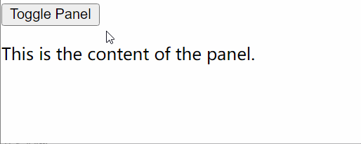

# [0025. 布尔属性](https://github.com/tnotesjs/TNotes.react/tree/main/notes/0025.%20%E5%B8%83%E5%B0%94%E5%B1%9E%E6%80%A7)

<!-- region:toc -->

- [1. 📝 概述](#1--概述)
- [2. 📒 布尔属性](#2--布尔属性)
- [3. 📒 在 HTML 中常见的布尔属性](#3--在-html-中常见的布尔属性)
- [4. 💻 demos.1 - 布尔属性在 React 中的应用示例](#4--demos1---布尔属性在-react-中的应用示例)
- [5. ⌛️ 历史：布尔属性名称的由来](#5-️-历史布尔属性名称的由来)

<!-- endregion:toc -->

## 1. 📝 概述

- 知道什么是布尔属性。

## 2. 📒 布尔属性

- **🤔 什么是布尔属性？**
  - 在 HTML 中，布尔属性（Boolean attributes）是一种特殊的属性类型，它们的存在与否决定了属性的值是 `true` 还是 `false`。
  - **如果一个布尔属性被设置在元素上，无论其值是什么，该属性都被视为 `true`。**
  - **如果该属性不存在，则它的值被视为 `false`。**
- **布尔属性的特点**
  - **不需要指定值**：当布尔属性出现在元素上时，它默认为 `true`。
  - **忽略属性值**：即使你给布尔属性指定了任何值（如 `checked="false"`），浏览器仍然会将其视为 `true`。
  - **只有存在或不存在两种状态**：布尔属性要么存在并表示 `true`，要么不存在并表示 `false`。

## 3. 📒 在 HTML 中常见的布尔属性

| 布尔属性 | 描述 |
| --- | --- |
| `disabled` | 用于表单控件（如 `<input>` 或 `<button>`），用来禁用控件，使其不可交互。 |
| `readonly` | 用于输入框（如 `<input type="text">` 或 `<textarea>`），防止用户修改内容。 |
| `checked` | 用于复选框（`<input type="checkbox">`）和单选按钮（`<input type="radio">`），表示是否被选中。 |
| `selected` | 用于下拉列表中的选项（`<option>`），表示该项是否被预先选择。 |
| `required` | 用于表单字段（如 `<input>`、`<textarea>` 和 `<select>`），表示该字段必须填写才能提交表单。 |
| `open` | 用于某些元素（如 `<details>`），表示该元素是否展开显示。 |

## 4. 💻 demos.1 - 布尔属性在 React 中的应用示例

::: code-group

```jsx {11-14} [1️⃣ 简写]
import { StrictMode } from 'react'
import { createRoot } from 'react-dom/client'

function App(props) {
  // console.log(props)
  return <p>props.boolProp: {props.boolProp + ''}</p>
}

createRoot(document.getElementById('root')).render(
  <StrictMode>
    <App boolProp />
    {/* 这是一种布尔属性的简写形式，相当于 boolProp={true} */}
    <App boolProp={true} />
    <App boolProp={false} />
  </StrictMode>
)
/* 
如果在调用某个组件时，需要传递一个布尔属性，并且值为 true，可以简写属性名，不需要写属性值。
  1. <Comp boolProp />
  2. <Comp boolProp={true} />
  上述两种写法等效。

<p>props.boolProp: {props.boolProp + ''}</p>
  注意：如果直接在页面上渲染一个 true，需要将其转为字符串类型后才能渲染出来。
    {true} 不会渲染出来。
    {'true'} 可以正常渲染。
  这里结尾的 + '' 的目的就是为了将 props.boolProp 转为一个字符串类型，确保 true 也能够正常渲染出来。
*/
```

```jsx {11,17,26,33} [2️⃣ 在表单中的使用]
import { StrictMode, useState } from 'react'
import { createRoot } from 'react-dom/client'

const App = () => {
  const [isDisabled, setIsDisabled] = useState(false)

  return (
    <>
      <p>
        <span>默认禁用按钮：</span>
        <button disabled>Click Me</button>
      </p>

      <p>
        <span>点击后切换按钮为禁用按钮：</span>
        <button
          disabled={isDisabled}
          onClick={() => setIsDisabled(!isDisabled)}
        >
          Click Me
        </button>
      </p>

      <p>
        <span>只读文本框：</span>
        <input type="text" value="Read-only text" readonly />
      </p>

      <p>
        <span>设置默认选中项：</span>
        <input type="radio" name="choice" id="yes" />
        <label for="yes">Yes</label>
        <input type="radio" name="choice" id="no" checked />
        <label for="no">No</label>
      </p>
    </>
  )
}

createRoot(document.getElementById('root')).render(
  <StrictMode>
    <App />
  </StrictMode>
)
```

```jsx {14} [3️⃣ 条件渲染]
import { StrictMode, useState } from 'react'
import { createRoot } from 'react-dom/client'

const Panel = ({ isOpen, children }) => (
  <div style={{ display: isOpen ? 'block' : 'none' }}>{children}</div>
)

const App = () => {
  const [isOpen, setIsOpen] = useState(false)

  return (
    <div>
      <button onClick={() => setIsOpen(!isOpen)}>Toggle Panel</button>
      <Panel isOpen={isOpen}>
        <p>This is the content of the panel.</p>
      </Panel>
    </div>
  )
}

createRoot(document.getElementById('root')).render(
  <StrictMode>
    <App />
  </StrictMode>
)
/* 
Panel 是一个可展开/折叠的面板组件。
布尔属性 isOpen 用来控制内容的显示或隐藏。

自定义的布尔属性在命名上，通常会采用 is、has、can…… 等词汇开头
表示“是否xxx？”、“有xxx？”、“能xxx？”……
表示一个开关状态，两者选其一。

⚠️ 注意事项：
1. <Panel isOpen={isOpen}>...</Panel>
2. <Panel isOpen>...</Panel>
上述这两种写法是不一样的。
写法 2 等价于 <Panel isOpen={true}>...</Panel>
意味着 isOpen 属性被设置为 true。
*/
```

:::

- **最终渲染结果：**

::: swiper




:::

## 5. ⌛️ 历史：布尔属性名称的由来

- 布尔属性的名称来源于数学和计算机科学中的布尔逻辑，这是以 19 世纪英国数学家乔治·布尔（George Boole）的名字命名的。布尔逻辑是一种代数系统，用于处理逻辑命题，它只有两个值：真（`true`）和假（`false`）。在编程中，布尔类型（boolean type）就是基于这种逻辑，用来表示二元状态的数据类型。
- 在 HTML 中，布尔属性的存在与否直接反映了这种二元状态。当一个布尔属性出现在元素上时，它的存在即代表了 `true` 的状态；而如果该属性没有出现在元素上，则意味着它的值为 `false`。这样的设计简化了标记语言的语法，并且使得这些属性的语义更加清晰明了。
- **示例**
  - `<input type="checkbox" checked>` 中的 `checked` 属性就是一个布尔属性。
  - 它的存在表明这个复选框默认是被选中的，而不需要额外指定 `checked="true"` 或者 `checked="checked"` 这样的值。
  - 同样地，如果去掉了 `checked` 属性，那么复选框就默认为未选中状态。
- 这种设计符合布尔逻辑的基本原则，即一种属性要么具有某种特性（`true`），要么不具有（`false`），没有中间状态。因此，这些属性被称为“布尔属性”。
- 它们在 Web 开发中提供了一种简洁的方式来表达特定的状态或行为，特别是在表单控件和其他交互元素中。
