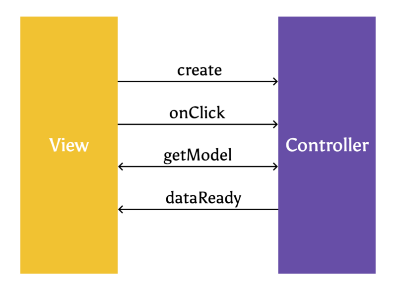

# [0029. 为什么说前端的 mvc 已死](https://github.com/Tdahuyou/TNotes.react/tree/main/notes/0029.%20%E4%B8%BA%E4%BB%80%E4%B9%88%E8%AF%B4%E5%89%8D%E7%AB%AF%E7%9A%84%20mvc%20%E5%B7%B2%E6%AD%BB)

<!-- region:toc -->

- [1. 🔗 links](#1--links)
- [2. 📒 notes](#2--notes)
- [3. 🤖 为什么说前端的 mvc 已死？](#3--为什么说前端的-mvc-已死)
  - [3.1. **复杂的状态管理**](#31-复杂的状态管理)
  - [3.2. **组件化**](#32-组件化)
  - [3.3. **单向数据流**](#33-单向数据流)
  - [3.4. **虚拟 DOM**](#34-虚拟-dom)
  - [3.5. **社区和生态系统**](#35-社区和生态系统)
  - [3.6. **开发体验**](#36-开发体验)
  - [3.7. 总结](#37-总结)

<!-- endregion:toc -->

- 理解为什么前端不适用 mvc 模式。

## 1. 🔗 links

- https://medium.com/free-code-camp/is-mvc-dead-for-the-frontend-35b4d1fe39ec
  - Is Model-View-Controller dead on the front end?
- https://juejin.cn/post/6844903447339204615
  - 掘金 - [译] MVC 在前端已死？

## 2. 📒 notes

- 在学习一些框架生态中的状态管理库（比如 React 中的 redux，vue 中的 vuex、pinia 等等）时，会涉及到这个问题“为什么说前端的 mvc 已死？”，理解这个问题，有助于加深对这些状态管理库出现原因的理解。即，**为什么前端需要有这些状态管理库呢？后端中应用的 mvc 模式如果搬运到前端来为什么不能用呢？**
- “前端的 MVC 已死”这一说法并不意味着 MVC（Model-View-Controller）架构模式本身已经完全过时或不再使用，而是指 **在现代前端开发中，MVC 模式逐渐被其他架构模式所取代，尤其是在单页应用（SPA）和复杂的前端应用中。**
- 许多开发者转向了更适合现代前端需求的架构模式，如 Flux/Redux、MVVM（Model-View-ViewModel）、以及基于组件化的架构模式。
- **后端中应用的 mvc 模式如果搬运到前端来为什么不能用呢？**
  - 在前端，用户的操作是及其复杂的，如果每个操作场景都需要对应一个 controller，这会导致数量庞大的 controller，可以认为 controller 的数量是无限的，这么显然是不合理的。
    - 
  - 在后端，controller 对应的并非用户操作，而是对应指定的接口，不同的用户操作很可能会打到同一个接口上，因此，controller 的数量是有限的，维护起来更加容易。
    - 

## 3. 🤖 为什么说前端的 mvc 已死？

### 3.1. **复杂的状态管理**

- **MVC 的局限性**：在传统的 MVC 架构中，状态通常由 Model 管理，而 View 和 Controller 之间的交互可能会变得复杂。随着应用变得越来越复杂，这种状态管理方式可能会导致代码难以维护。
- **替代方案**：现代前端框架如 React、Vue 和 Angular 提供了更强大的状态管理解决方案，例如 Redux、Vuex 和 NgRx，这些工具使得状态管理更加集中和可预测。

### 3.2. **组件化**

- **MVC 的限制**：MVC 架构在处理大量可重用组件时可能不够灵活。每个组件需要与 Model 和 Controller 进行交互，这可能导致代码重复和耦合度增加。
- **替代方案**：现代前端框架如 React 和 Vue 强调组件化开发，允许开发者创建独立且可重用的组件。每个组件可以有自己的状态和生命周期，使得代码更加模块化和易于维护。

### 3.3. **单向数据流**

- **MVC 的双向绑定**：MVC 中的 View 和 Model 之间通常是双向绑定的，这意味着当 Model 发生变化时，View 会自动更新，反之亦然。这种双向绑定在某些情况下会导致调试困难和性能问题。
- **替代方案**：现代前端框架如 React 推崇单向数据流，数据从父组件传递到子组件，通过 props 传递。这种模式使得数据流动更加清晰，便于调试和维护。

### 3.4. **虚拟 DOM**

- **MVC 的性能问题**：在传统的 MVC 架构中，每次 Model 发生变化时，View 都需要重新渲染，这可能导致性能问题。
- **替代方案**：现代前端框架如 React 使用虚拟 DOM 来优化渲染过程。虚拟 DOM 只更新实际发生变化的部分，从而提高性能。

### 3.5. **社区和生态系统**

- **MVC 的生态**：虽然 MVC 在后端开发中有广泛的社区支持，但在前端领域，尤其是 SPA 开发中，它的生态系统不如现代前端框架丰富。
- **替代方案**：React、Vue 和 Angular 等现代前端框架拥有庞大的社区和丰富的生态系统，提供了大量的库、工具和插件，使得开发变得更加高效和便捷。

### 3.6. **开发体验**

- **MVC 的开发体验**：在传统的 MVC 架构中，开发者需要手动管理 View 和 Controller 之间的交互，这可能导致开发体验不佳。
- **替代方案**：现代前端框架提供了更简洁和直观的 API，使得开发体验更加流畅。例如，React 的 JSX 语法使得组件结构更加直观，Vue 的模板语法也提供了类似的好处。

### 3.7. 总结

尽管 MVC 架构在某些场景下仍然适用，特别是在一些简单的 Web 应用中，但在现代前端开发中，特别是对于复杂的单页应用和大型项目，MVC 的局限性逐渐显现。因此，许多开发者转向了更适合现代前端需求的架构模式，如 Flux/Redux、MVVM（Model-View-ViewModel）、以及基于组件化的架构模式。

然而，重要的是要理解每种架构模式都有其适用的场景，选择合适的架构模式应根据项目的具体需求和技术栈来决定。如果你有具体的项目需求或技术选型问题，我可以提供更详细的建议。
